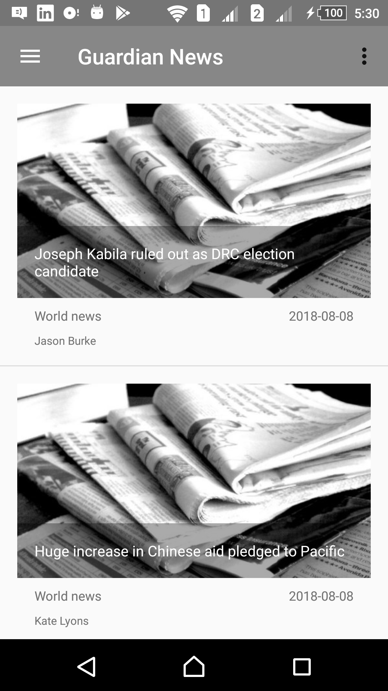
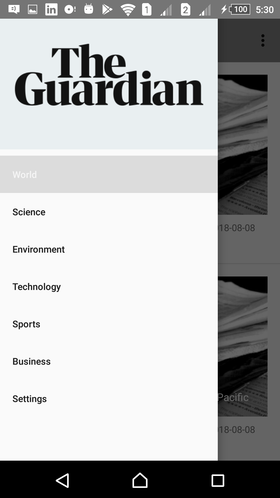
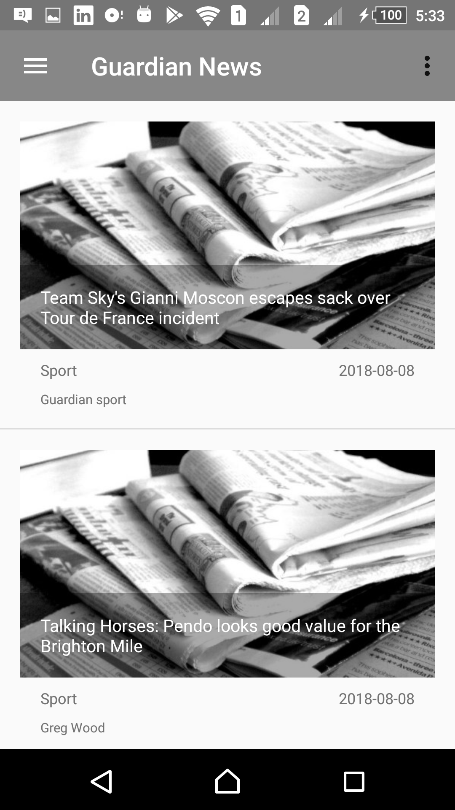
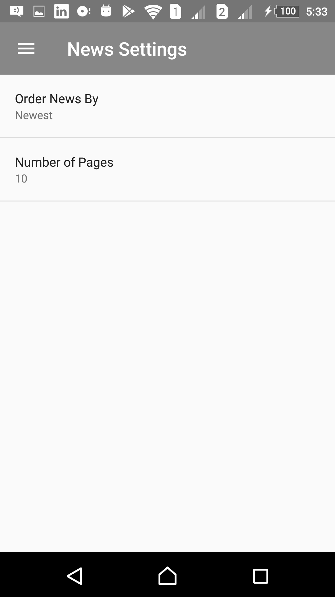

# ABND-Proj6-Guardian-News-App

The sixth project in the Android Basics nanodegree by Google and Udacity: "**News App**".
It consists of the first and the second stages of the News App project in the fourth course of the nanodegree "Networking".

***

  

 

***

## Udacity's Project Overview:

#### First Stage:

You will be making your own app that connects to the Internet to provide news articles on a topic of your choice.

The goal is to create a News Feed app which gives a user regularly-updated news from the internet related to a particular topic, person, or location. The presentation of the information as well as the topic is up to you. 

[Project Stage 1 Rubric](https://review.udacity.com/#!/rubrics/1138/view)

#### Second Stage:

You are expected to have passed the News App, Stage 1 project prior to beginning this project.

The goal is to add a Settings Screen to the News Feed app you made earlier in Part 1 which will allow users to narrow down the stories displayed in from the feed. The available preference options presented to the user will be left up to you to decide (e.g. publishing time, country, topic category, etc. )

[Project Stage 2 Rubric](https://review.udacity.com/#!/projects/344/view)

## App Overview:

It is a simple lightweight news app that fetches news stories from [The Guardian](https://www.theguardian.com) API.

Along with the main list of news stories in the main activity screen, the app has a side navigation drawer that lets the user get to the settings screen or switch among different kind of news stories like Technology, Science, Sports, etc. 

An option to refresh using "Swipe down" is provided along with another refresh button in the options menu, and upon clicking on some news, the app will direct you to the story's page on the Gurdian website as shown in the screenshots. 

It also has a settings activity which can be accessed from the side drawer, in which you can modify the order of the news list, and the number of stories displayed.

## Android Features:

1. DrawerLayout and NavigationView
2. ListView and ArrayAdapter
3. SwipeRefreshLayout (Swipe To Refresh Option)
4. Options Menu
5. SharedPreferences
6. AsyncTaskLoader and LoaderManager
7. HTTP Networking
8. JSON Parsing

#### Note:

- You would need to get your own api-key from [The Guardian Open Platform](https://open-platform.theguardian.com/access/) in order to see news. Otherwise the app will show nothing since it is using the test key.
This may be modified in the MainActivity's first few lines.
- The dummy newspaper image is used, since the API didn't provide a free way to download news images.
